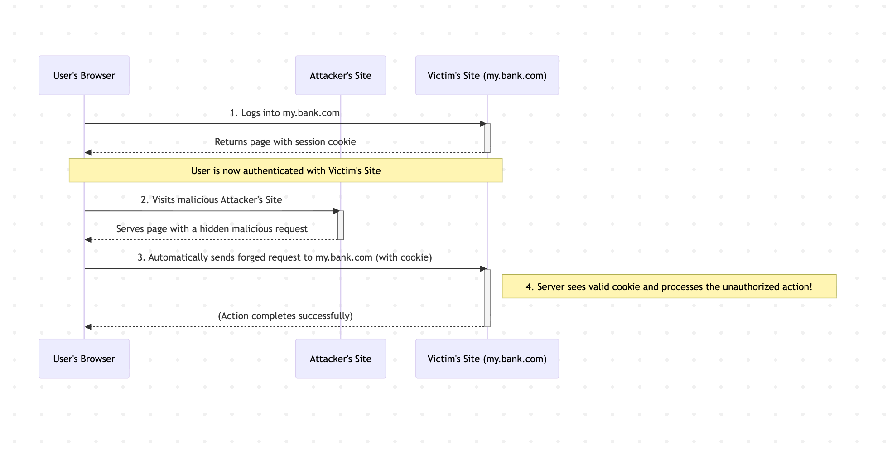
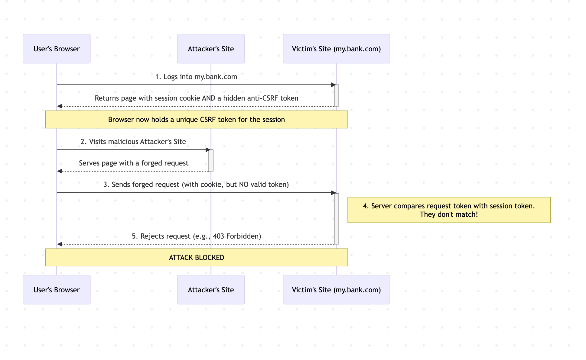

Imagine one of your loyal users changes their account email address and password without ever logging in or visiting your website. Impossible, right? Not exactly. This isn't a scene from a cyberpunk novel; it's the result of a subtle, powerful, and often misunderstood web vulnerability: **Cross-Site Request Forgery (CSRF)**.

CSRF attacks are the imposters of the web security world. They don't steal a user's credentials; instead, they hijack a user's authenticated session to perform actions on their behalf. At Wawandco, we believe in making the complex simple, transforming daunting technological challenges into elegant solutions. This guide will demystify CSRF, showing you how it works, why it's a silent threat, and how to implement robust, production-ready defenses to protect your applications and your users.

## What is CSRF? The Anatomy of an Attack

Cross-Site Request Forgery (also known as a "one-click attack" or "session riding") tricks a victim's web browser into executing an unwanted action on a website where they are currently logged in. The application trusts the request because it's coming from a legitimate, authenticated user—complete with their session cookie. The problem is, the user never intended to perform that action.

Think of it like a **forged check**. The bank (your web application) sees a check with a valid signature (the user's session cookie) and cashes it. The bank doesn't know that someone else filled in the "pay to" and "amount" fields (the malicious action).

Here’s a simplified step-by-step example of how a CSRF attack unfolds:

1.  **The User is Authenticated**: A user logs into their trusted banking website, `https://my.bank.com`. The site places a session cookie in their browser to keep them logged in.
2.  **The Bait is Set**: The attacker crafts a malicious link, image, or form and embeds it on a website they control or in an HTML email. For example, they could embed a hidden image that secretly triggers a request:

```html

```

3.  **The Trap is Sprung**: The unsuspecting user visits the attacker's website or opens the malicious email. Their
browser sees the `` tag and automatically sends a `GET` request to the `src` URL to load the image.
4.  **The Attack Succeeds**: Because the user is still logged into `my.bank.com`, their browser helpfully includes the session cookie with the request. The bank's server receives the request, sees the valid session cookie, and processes the transfer. It has no way of knowing the user didn't initiate this action.

Here is a visual representation of the attack flow:



The user has now lost $1,000, and the only evidence is a 1x1 pixel invisible image they never knew was there.


## Why CSRF is a Silent But Significant Threat

CSRF is particularly insidious because it exploits the trust an application has in its users. It doesn't require the attacker to steal passwords or session tokens. According to the **Open Web Application Security Project (OWASP)**, CSRF was historically so prevalent that it earned a spot on their Top 10 list of critical web application security risks for years. While modern frameworks have improved defenses, the underlying vulnerability patterns persist, often categorized under broader issues like "Broken Access Control."

The impact of a successful CSRF attack can range from annoying to catastrophic:

  * Changing a user's email or password, leading to **account takeover**.
  * Making **unauthorized purchases** or financial transfers.
  * **Deleting critical data**, such as entire user accounts or content.
  * Submitting spam or malicious content on behalf of the user.

A single CSRF vulnerability can erode user trust and lead to significant financial and reputational damage. A 2023 report by **IBM** found that the average cost of a data breach reached **$4.45 million**, highlighting the immense financial incentive to get security right the first time.

## The Gold Standard: How to Mitigate CSRF Attacks

The key to defeating CSRF is to verify **intent**, not just **identity**. The server needs proof that the user actually intended to submit the request. The most reliable and widely adopted method for this is the **Synchronizer Token Pattern**, often just called Anti-CSRF Tokens.

Here’s how it works:

1.  **Token Generation**: When a user logs in or visits a page with a form, the server generates a unique, unpredictable, and secret token. This token is tied to the user's session.
2.  **Token Embedding**: The server embeds this token as a hidden field in every state-changing form (e.g., forms for updating profiles, transferring funds, or deleting data).
    ```html
    <form action="/update-profile" method="post">
      <input type="hidden" name="csrf_token" value="a1b2c3d4-e5f6-7890-a1b2-c3d4e5f67890">
      <button type="submit">Update</button>
    </form>
    ```
3.  **Token Validation**: When the user submits the form, the `csrf_token` is sent back to the server along with the other form data.
4.  **Server-Side Check**: Before processing the request, the server compares the token submitted in the form with the token it stored in the user's session.

**If the tokens match**, the server knows the request is legitimate. **If they don't match or the token is missing**, the request is rejected. An attacker cannot guess this token or read it from the user's browser, so any forged request will fail.

This diagram shows how the token blocks the attack:



### Other Important Defenses

While anti-CSRF tokens are the primary defense, they work best as part of a layered security strategy:

  * **SameSite Cookies**: This is a browser-level security mechanism. Setting a cookie's `SameSite` attribute to `Strict` or `Lax` provides excellent protection against most CSRF attacks by controlling when cookies are sent with cross-site requests.
  * **Custom Request Headers**: For AJAX/API calls, checking for the presence of a custom header (like `X-Requested-With: XMLHttpRequest`) can be an effective defense, as these headers cannot be added to cross-origin requests by an attacker.


## Common Pitfalls and Anti-Patterns to Avoid

Implementing CSRF protection correctly requires careful attention to detail. Here are common mistakes to avoid:

1.  **Using `GET` Requests for State-Changing Actions**: A `GET` request should **never** change the state of the application (e.g., delete a user). They should only be used for safe operations like retrieving data. As seen in our example, `GET` requests are trivial to exploit.
2.  **Storing the CSRF Token in a Cookie**: Placing the anti-CSRF token in a cookie is useless. The browser automatically sends all cookies—including the token cookie—with the forged request, so the validation will pass.
3.  **Relying Only on the `Referer` Header**: Checking the `Referer` header to see if a request came from your own domain is unreliable. This header can be spoofed, suppressed by browsers for privacy, or absent entirely.


## Conclusion: Building a Resilient and Secure Application

CSRF is a serious vulnerability that leverages the very trust your application is built on. But with the right architectural foresight, it's entirely preventable. The solution lies in implementing robust validation that confirms user intent for every sensitive action, primarily through the use of anti-CSRF tokens.

Building secure, scalable, and production-ready applications is our specialty at Wawandco. While your competitors are stuck navigating complex security landscapes or dealing with slow, 6-month hiring cycles, our expert teams are ready to deploy this week, shipping features 30% faster with 99.9% uptime architecture and seamless CI/CD workflows. We solve impossible technological challenges with an elegance that makes the complex simple.

**Ready to fortify your application and accelerate your roadmap? Get in touch with Wawandco today.**

### References
- OWASP. (n.d.). Cross-Site Request Forgery (CSRF). OWASP Foundation. Retrieved from https://owasp.org/www-community/attacks/csrf

- IBM. (2023). Cost of a Data Breach Report 2023. IBM Corporation. Retrieved from https://www.ibm.com/reports/data-breach
